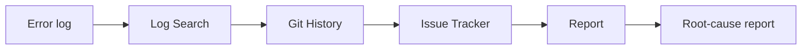

# Incident-Triage Agent

[](https://github.com/hharshitarora/incident-triage-agent/actions/workflows/ci.yml)

> Point it at your logs + git history + issue tracker, and it returns a root-cause triage report — suspect commit, confidence, owner, and next steps.

An orchestrated agent that automates the first twenty minutes of every production incident: it reads the error, walks git history back to the change that caused it, checks for related issues, and writes up a root cause you can act on.

This is the open, generalized version of an incident-triage workflow I built in production at a large retailer (where it cut failure-investigation time 50–60%) — rebuilt from scratch as a proper orchestrator so each investigation phase is independently controllable and swappable. See [`DECISIONS.md`](./DECISIONS.md) for the why.

## How it works

Four independently-controllable phases, wired with LangGraph:



- **Log Search** *(LLM)* — parses the raw error into a stable signature, stack frames, and the implicated source files.
- **Git History** *(deterministic)* — walks `git log`/`git show` on those files, ranks recent commits, and attaches the **diff** of the prime suspects. No LLM here — the highest-signal step stays fully inspectable.
- **Issue Tracker** — searches GitHub issues for related or duplicate reports. Skips gracefully if unconfigured.
- **Report** *(LLM)* — synthesizes a calibrated root-cause report from the evidence, citing the exact diff that introduced the bug.

## Quickstart

```bash
git clone https://github.com/hharshitarora/incident-triage-agent
cd incident-triage-agent
python -m venv .venv && source .venv/bin/activate     # Windows: .venv\Scripts\activate
pip install -r requirements.txt
cp .env.example .env                                  # add your OPENAI_API_KEY

# build a demo repo with a planted bug, then triage it from the crash log alone
python demo/build_demo.py
python -m triage --repo demo/.sandbox --log demo/error.log
```

## Example

The demo plants a bug: a *"simplify discount lookup"* commit swaps `DISCOUNTS.get(code, 0.0)` for `DISCOUNTS[code]`, which `KeyError`s on any unknown promo code. Given **only the crash log**, the agent traces it back:

```
====================================================================
  INCIDENT TRIAGE REPORT
====================================================================
  Summary      : KeyError in discount lookup due to missing key in DISCOUNTS dictionary.
  Root cause   : The KeyError for 'SUMMER25' in apply_discount is caused by commit
                 8776d29 by Dana Lee, which altered the lookup from
                 DISCOUNTS.get(code, 0.0) to DISCOUNTS[code], removing the default
                 value handling.
  Confidence   : 90%
  Severity     : high
  Suspect      : 8776d29d5e
  Owner        : Dana Lee
  Next steps   :
    - Revert the change in commit 8776d29 to restore the default value handling.
    - Add regression tests for unknown promo codes.
--------------------------------------------------------------------
  phases:
    · log_search: KeyError · 2 frames · 2 files
    · git_history: 3 suspect commit(s) across 2 file(s)
    · report: confidence=0.90 · severity=high
====================================================================
```

It names the culprit commit **and** its author from the crash log alone.

## Reliability

- **Structured output + retries** at the LLM boundary — every model call returns a validated schema, or fails loudly in one place.
- **Per-phase OpenTelemetry spans** — run with `OTEL_CONSOLE=1` to see them; point an OTLP exporter at your collector in prod.
- **Graceful degradation** — a missing repo or unreachable issue tracker produces a warning, not a crash. A triage tool that lies about certainty is worse than none.

## Tests

```bash
pip install -r requirements-dev.txt
pytest
```

Hermetic — no network, no LLM calls. CI runs them on every push.

## Stack

Python · LangGraph · OpenAI · GitHub API · OpenTelemetry
